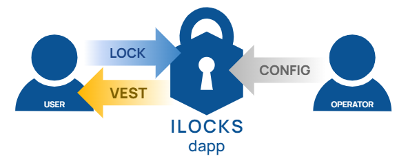
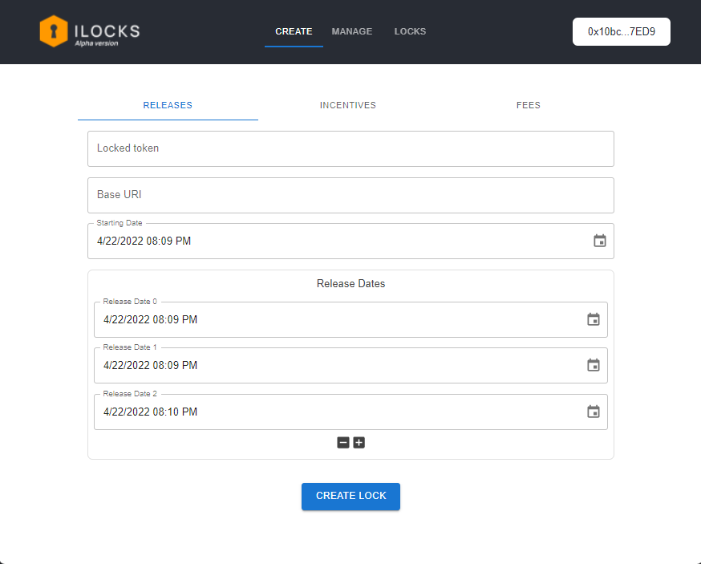

********************************************************************
Note: This repo is not under maintenning. 
This repo is written only for POC. ILOCKS is implemented simply for demostration.
If you want access a commercial version of this application, please send me an email. Thanks!
********************************************************************

# Full Documentation
Access the full documentation for this project, including the video presentation, following this link: [Full Documentation](./docs/) 👈

# Disclaimer
This presentation is not either an investment advice or a recommendation or solicitation to buy or sell any investment and should not be used in the evaluation of the merits of making any investment decision. It should not be relied upon for accounting, legal or tax advice or investment recommendations. The contents reflected herein are subject to change without being updated. The codes are written for informational and educational purpose only.

USE THE SOFTWARE AT YOUR OWN RISK. YOU ARE RESPONSIBLE FOR YOUR OWN MONEY. PAST PERFORMANCE IS NOT NECESSARILY INDICATIVE OF FUTURE RESULTS. THE AUTHORS AND ALL AFFILIATES ASSUME NO RESPONSIBILITY FOR YOUR TRADING RESULTS.

# ILOCKS - Incentivized Token Lock
ILOCKS is a token time lock and token vesting decentralized application. It is a simple dapp that holds digital assets for some time and vests tokens according to predefined conditions. 

Token locks and token vesting applications are a common use case for smart contracts. It is maily used to: 
- Protect liquidity, reducing the risk of liquidity being pulled all at once by project owners, the famous rug-pull, and also ensuring liquidity for market participants.
- Reduce Sell Pressure, Projects can lock a percentage of their pre-mined token supply or team-owned tokens. this way, the community, and investors can be reassured that tokens will not be mass dumped by the team during the contract period.
- Reward Contributor, DAOs use token vesting mechanisms to reward investors and contributors with governance tokens with reduced price impact due to distribution deferred over time.

# Ouline of Problem
Despite of the utility of token locks and token vesting applications, the main projects offering these services provide limited customization for their users. The three main service providers only offer customization of lock duration (days) and vesting frequency (hour, day, week, month and etc.).

# The Solution
Using ILOCKS, the user can set the following parameter for the lock: duration, fees, incentives, and also how these parameters will behave over time.

# How it works
Operators can create a lock schedule specifying: starting data, release dates, token locked, reward rate, vesting schedule, and fees.

The User selects a lock and lock their tokens to receive a fungible position of locked tokens. After locking the can claim their reward tokens according to the predifined schedule.

# Screen Shot

# About the Project
## Author
Name  | Git Hub | LinkedIn 
------------- | ------------- | ------------- 
Rafael Albuquerque Bezerra  | [albuquerque-rafael](https://github.com/albuquerque-rafael) | [rafael-albuquerque-bezerra](https://www.linkedin.com/in/rafael-albuquerque-bezerra/) 

## Revisions
Date  |  Revision  |  Description  |  Author
--------  |  --------  |  --------  |  --------	
12/04/2022  |  `0.1`  |  First Draft  |  Rafael A. Bezerra
22/04/2022  |  `0.2`  |  Final Review  |  Rafael A. Bezerra

# MIT License
Copyright (c) 2022

Permission is hereby granted, free of charge, to any person obtaining a copy of this software and associated documentation files (the "Software"), to deal in the Software without restriction, including without limitation the rights to use, copy, modify, merge, publish, distribute, sublicense, and/or sell copies of the Software, and to permit persons to whom the Software is furnished to do so, subject to the following conditions:

The above copyright notice and this permission notice shall be included in all copies or substantial portions of the Software.

THE SOFTWARE IS PROVIDED "AS IS", WITHOUT WARRANTY OF ANY KIND, EXPRESS OR IMPLIED, INCLUDING BUT NOT LIMITED TO THE WARRANTIES OF MERCHANTABILITY, FITNESS FOR A PARTICULAR PURPOSE AND NONINFRINGEMENT. IN NO EVENT SHALL THE AUTHORS OR COPYRIGHT HOLDERS BE LIABLE FOR ANY CLAIM, DAMAGES OR OTHER LIABILITY, WHETHER IN AN ACTION OF CONTRACT, TORT OR OTHERWISE, ARISING FROM, OUT OF OR IN CONNECTION WITH THE SOFTWARE OR THE USE OR OTHER DEALINGS IN THE SOFTWARE.